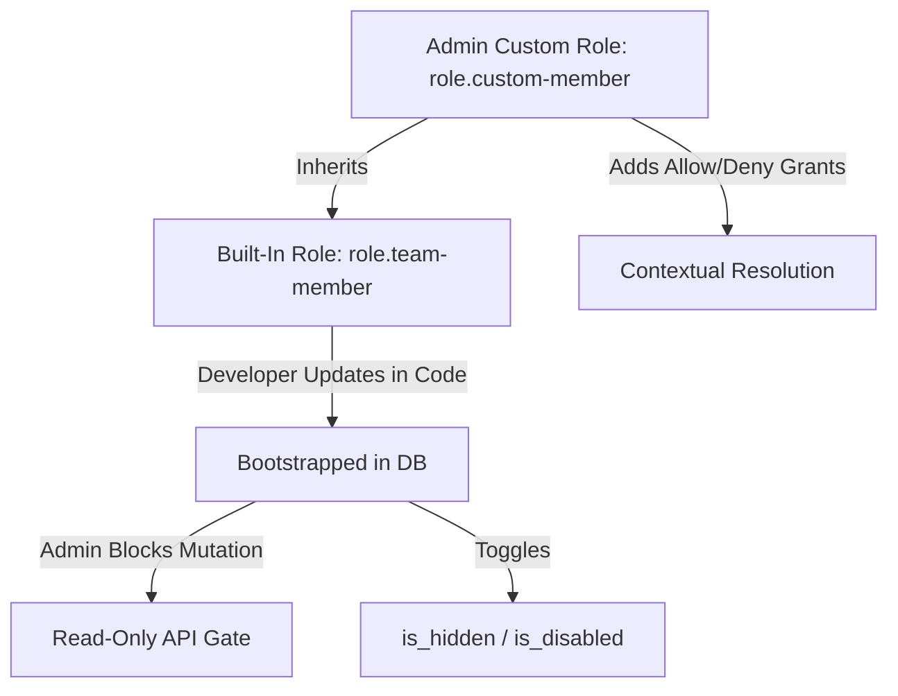

# Architectural Design: Release-Safe Built-In & Custom Roles

This document outlines a highly robust, secure, and developer-friendly strategy for managing **Built-In (System-Managed) Roles** alongside **Custom Roles** in `arkloud-api`. 

It fulfills the following requirements:
1. **Developer-Declared Defaults:** Developers define roles in code with intelligent default permissions.
2. **Release-Safe Seeding:** Upgrades to newer software versions cleanly and idempotently add new permissions to existing built-in roles.
3. **Admin Restrictions (Read-Only):** Admins cannot directly modify or delete built-in roles; they can only toggle their visibility (**Hidden**) or status (**Disabled/Unusable**).
4. **Clean Customization via Inheritance:** If admins need a customized version of a built-in role, they create a **Custom Role** that inherits from the built-in role and add/deny permissions as needed.

---

## 1. Core Data Model Extensions

The PostgreSQL `roles` table is already equipped with a `built_in` flag. We will extend this schema with two additional administrative flags:

```sql
ALTER TABLE roles ADD COLUMN IF NOT EXISTS is_hidden BOOLEAN NOT NULL DEFAULT false;
ALTER TABLE roles ADD COLUMN IF NOT EXISTS is_disabled BOOLEAN NOT NULL DEFAULT false;
```

- `built_in`: Set to `true` for system-managed roles declared in code.
- `is_hidden`: If `true`, the role continues to function, but it is filtered out of the Admin UI dropdowns (preventing new assignments).
- `is_disabled`: If `true`, the role is completely inactive. The evaluation engine will ignore assignments of this role during permission checks.

---

## 2. The 3-Tier Role Architecture



### Tier 1: Developer Declaration (In-Code)
Developers declare built-in roles in their feature packages (e.g. `features/backup/permissions.go` or a shared `auth` package) alongside the feature permissions:

```go
package auth

import "github.com/wtiger001/go-permissions"

var (
	RoleBackupOperator = permissions.Role{
		ID:          "role.backup-operator",
		Name:        "Backup Operator",
		Description: "Allows running, listing, and downloading system backups.",
		VariableSpec: map[string]any{
			"team": "required",
		},
		Permissions: []string{
			"backup.backups.list",
			"backup.backup.run",
			"backup.backup.download",
			"backup.backupjob.read",
		},
	}
)
```

### Tier 2: Release-Safe Bootstrapping (Idempotent Seeding)
During application startup, the bootstrapping pipeline reads these definitions and merges them into the database. If a new software version adds a permission to a built-in role, it is dynamically added without overwriting any custom roles or admin visibility toggles:

```go
func BootstrapBuiltInRole(ctx context.Context, store permissions.PermissionStore, role permissions.Role) error {
	// 1. Check if the role already exists in the database
	existing, err := store.RoleDefinition(ctx, role.ID)
	if err != nil {
		// 2. Role does not exist: Create it cleanly as built-in
		roleInDB := permissions.Role{
			ID:           role.ID,
			Name:         role.Name,
			Description:  role.Description,
			VariableSpec: role.VariableSpec,
		}
		// Write to DB with built_in = true
		if err := store.CreateRole(ctx, roleInDB); err != nil {
			return err
		}
	} else {
		// 3. Role already exists: Dynamically update only the metadata
		// This keeps default definitions updated across releases!
		existing.Name = role.Name
		existing.Description = role.Description
		existing.VariableSpec = role.VariableSpec
		if err := store.UpdateRole(ctx, existing); err != nil {
			return err
		}
	}

	// 4. Sync the default permission grants idempotently
	grants := make([]permissions.Grant, len(role.Permissions))
	for i, permID := range role.Permissions {
		grants[i] = permissions.Grant{
			OwnerKind:      permissions.PrincipalRole,
			OwnerID:        role.ID,
			Effect:         permissions.EffectAllow,
			TeamScope:      "*", // Or '?team' resolved contextually
			PermissionName: permID,
		}
	}
	
	return svc.EnsureGrantsForOwners(ctx, grants)
}
```

### Tier 3: Read-Only Enforcement (REST API Gate)
In your `arkloud-api` REST handlers for role mutations, enforce a strict read-only gate on any role marked `built_in = true`:

```go
func HandleDeleteRole(w http.ResponseWriter, r *http.Request, store permissions.PermissionStore) {
	roleID := ParseRoleID(r)
	
	role, err := store.RoleDefinition(r.Context(), roleID)
	if err != nil {
		http.Error(w, "Role not found", http.StatusNotFound)
		return
	}
	
	// PROTECT BUILT-IN ROLES
	if role.BuiltIn {
		http.Error(w, "System-managed roles are read-only and cannot be deleted.", http.StatusForbidden)
		return
	}
	
	// Proceed with custom role deletion...
}
```

---

## 3. Administrative Toggles: Hidden & Disabled

Admins can customize built-in roles *only* by altering their operational status using PATCH endpoints:

### 3.1 Toggle Visibility (`is_hidden`)
If an admin wants to hide a role (e.g. they don't want team managers to assign the legacy `Backup Operator` role), they patch `is_hidden = true`.
- **API List Filter:** The `ListRoles` endpoint in `arkloud-api` filters out any role where `is_hidden = true` when queried by standard UI clients.
- **Result:** The role becomes invisible in configuration dropdowns, but existing user assignments continue to function.

### 3.2 Toggle Status (`is_disabled`)
If an admin wants to revoke a role completely, they patch `is_disabled = true`.
- **Go service hook:** In `service.go`'s assignment resolution phase, we filter out any assignments for disabled roles:
  ```go
  // Inside resolveRoleAssignmentsForUserAndGroups
  for _, assignment := range resolvedAssignments {
      roleDef, err := s.permissions.RoleDefinition(ctx, assignment.RoleID)
      if err == nil && roleDef.IsDisabled {
          continue // IGNORE DISABLED ROLES
      }
      result = append(result, assignment)
  }
  ```

---

## 4. Customizing via Inheritance: No Force-Feeding

Admins are **never forced** to use built-in roles. If they want a tailored variant of the `Backup Operator` role (e.g., they want it to do everything except downloading archives), they follow this clean customization pattern:

1. **Create a Custom Role:** Admin creates `role.custom-operator` in the UI.
2. **Inherit the Built-In Role:** The API links them:
   ```go
   store.AddRoleInheritance(ctx, "role.custom-operator", "role.backup-operator")
   ```
3. **Add a Deny Override:** The admin adds a direct `deny` grant to `role.custom-operator` for the download permission:
   ```go
   svc.EnsureGrantForOwner(ctx, permissions.Grant{
       OwnerKind:      permissions.PrincipalRole,
       OwnerID:        "role.custom-operator",
       Effect:         permissions.EffectDeny,
       TeamScope:      "*",
       PermissionName: "backup.backup.download", // DENY OVERRIDES ALLOW
   })
   ```

### Why this is exceptionally clean:
- **No Upgrade Conflicts:** When you release a new version of `arkloud-api` that adds a new `backup.backups.optimize` permission to the built-in `role.backup-operator`, the database bootstrap **instantly updates it**.
- **Automatic Inheritance Propagation:** Because the admin's custom role (`role.custom-operator`) inherits from `role.backup-operator`, **it automatically inherits the new optimization permission** without any manual admin intervention! 
- **Preserved Denies:** The custom `deny` for downloads remains perfectly active.
